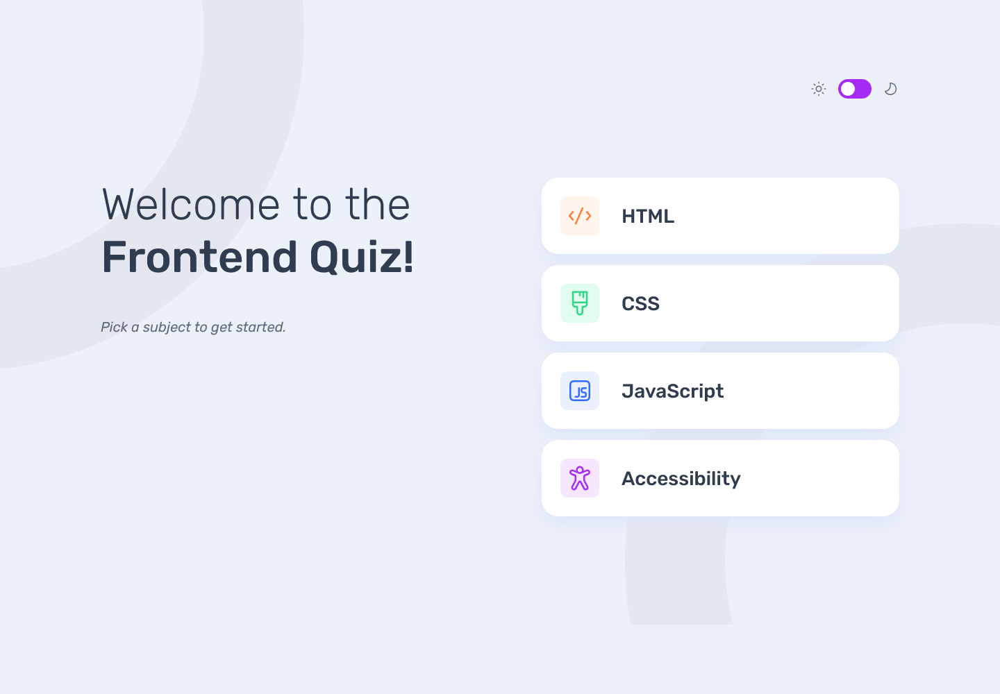
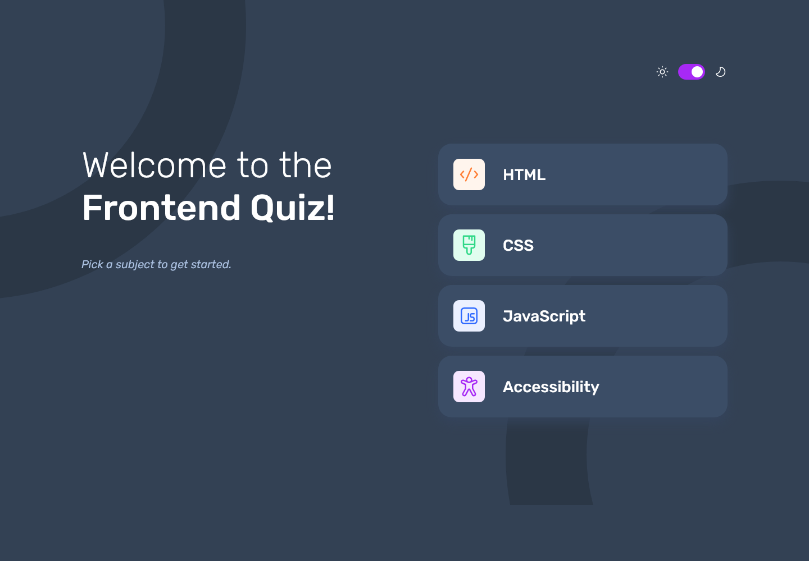

# Frontend Mentor - Frontend quiz app solution

This is my solution to the [Frontend quiz app challenge on Frontend Mentor](https://www.frontendmentor.io/challenges/frontend-quiz-app-BE7xkzXQnU).

## Table of contents

- [Overview](#overview)
  - [The challenge](#the-challenge)
  - [Screenshot](#screenshot)
  - [Links](#links)
- [My process](#my-process)
  - [Built with](#built-with)
  - [What I learned](#what-i-learned)
  - [Continued development](#continued-development)
  - [Useful resources](#useful-resources)
- [Author](#author)

## Overview

### The challenge

Users should be able to:

- Select a quiz subject
- Select a single answer from each question from a choice of four
- See an error message when trying to submit an answer without making a selection
- See if they have made a correct or incorrect choice when they submit an answer
- Move on to the next question after seeing the question result
- See a completed state with the score after the final question
- Play again to choose another subject
- View the optimal layout for the interface depending on their device's screen size
- See hover and focus states for all interactive elements on the page
- Navigate the entire app only using their keyboard
- **Bonus**: Change the app's theme between light and dark

### Screenshot




### Links

- Solution URL: [My solution](https://www.frontendmentor.io/solutions/frontend-quiz-app-with-scss-and-javascript-aY7ihgsfN3)
- Live Site URL: [Live site URL](https://frontend-quiz-app.netlify.app/)

## My process

### Built with

- Semantic HTML5 markup
- SASS
- Flexbox
- CSS Grid

### What I learned

#### Vite and SCSS

This was my first time building a project with Vite and SCSS. I learned that as a project grows more complex, it’s best to split styles into separate files. Doing this makes the project much easier to maintain and gives me better control over the styling.

#### CSS and JavaScript for Light/Dark Theme

I also learned how to create an accessible theme toggle. The app can switch between light and dark themes, and it even adapts to the system’s default color scheme using window.matchMedia("(prefers-color-scheme: dark)"). To make the experience consistent, I stored the user’s last selected theme in localStorage, so the browser remembers it.

#### JavaScript for Quiz Logic

For the quiz functionality, I had to figure out how to track the selected subject and the index of the current question. I used a startQuiz function to initialize this. Then, in the loadQuestion function, I display the current question and its possible answers. Once an answer is selected and the submit button is clicked, the app moves on to the next question.

This part was the most challenging for me — I had to experiment multiple times before reaching the result I wanted. Here’s a snippet of the loadQuestion function that handles rendering the current question and options:

```js
function loadQuestion() {
  const q = currentQuiz.questions[currentQuestionIndex];
  currentEl.textContent = currentQuestionIndex + 1;
  progressEl.value = currentQuestionIndex + 1;
  progressEl.max = currentQuiz.questions.length;

  questionEl.textContent = q.question;

  quizList.innerHTML = "";

  q.options.forEach((opt, index) => {
    const li = document.createElement("li");
    const btn = document.createElement("button");
    btn.className = "btn btn-light";
    btn.innerHTML = `<span class="option-letter">${String.fromCharCode(
      65 + index
    )}</span> `;
    const textSpan = document.createElement("span");
    textSpan.classList.add("answer-text");
    textSpan.textContent = opt;
    btn.appendChild(textSpan);
    li.appendChild(btn);
    quizList.appendChild(li);

    btn.addEventListener("click", () => selectAnswer(btn, opt));
  });

  selectedAnswer = null;
  dangerText.style.display = "none";
  submitBtn.classList.add("btn-inactive");
}
```

### Continued development

For future projects, I want to keep improving how I structure SCSS in larger applications, so my style files stay clean and easy to maintain. I also want to practice writing more advanced JavaScript logic to make my apps more dynamic and interactive.

### Useful resources

- [The HTML5 progress Element](https://css-tricks.com/html5-progress-element/) - This helped me to style progress bar with CSS.

## Author

- Frontend Mentor - [@JiaHe35354](https://www.frontendmentor.io/profile/JiaHe35354)
